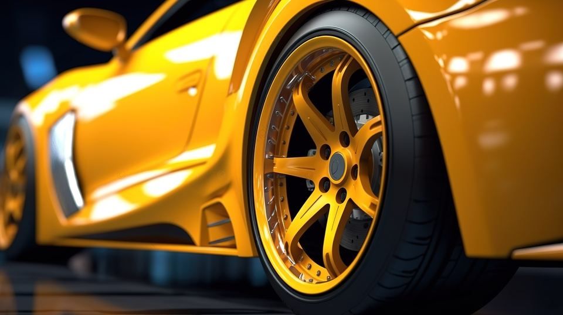

# Ride car

## Equipo de desarrollo

- Maria ethnea zarate
-Lautaro blas diaz
-Thomas vai
-Elea Borstner

# Race Car
¿Qué tan lejos puedes llegar? 

El objetivo de este juego es esquivar a los autos rojos que circulan en dirección opuesta sobre la pista y recolectar las monedas que aparecen para así alcanzar la cantidad de puntos necesarios para pasar de nivel o ganar el juego. 

El jugador puede _perder una vida_ si colisiona con alguno de los autos violetas, naranjas o grises, y el juego finaliza si el jugador pierde todas las vidas.

## Modo de juego

### Controles
Se utilizan las **flechas** para mover el auto en dirección horizontal por la pista.

### Los obstáculos:
#### Autos rojos
Evita chocar a los **autos rojos** pues hacerlo ocasiona la pérdida de dos monedas.

#### Autos violetas
Al chocar un **auto violeta** se pierden dos monedas y una vida 

### Autos naranjas
Al chocar con un **auto naranja** se pierde el juego.

### Autos grises
Al chocar con un **auto gris** se restan dos vidas.

#### Monedas
Las **monedas** son un tipo diferente de obstáculo, caen en intervalos regulares y a una velocidad menor que los autos.

## Niveles de dificultad
### Modo Facil
Para ganar en este nivel, el jugador deberá alcanzar **10 monedas**. 
En este nivel los autos rojos circularán a una velocidad `leve` y el jugador cuenta con _tres vidas_ para intentarlo. 

### Modo Dificil.
Para ganar en este nivel, el jugador deberá alcanzar **20 monedas**. 
En este nivel los autos de colores circularán a una velocidad `intensa`. 

### Repositorio publico
No tenemos problemas en que este proyecto sea un repositorio publico.

